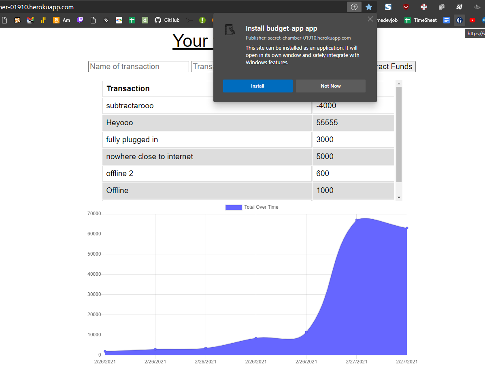
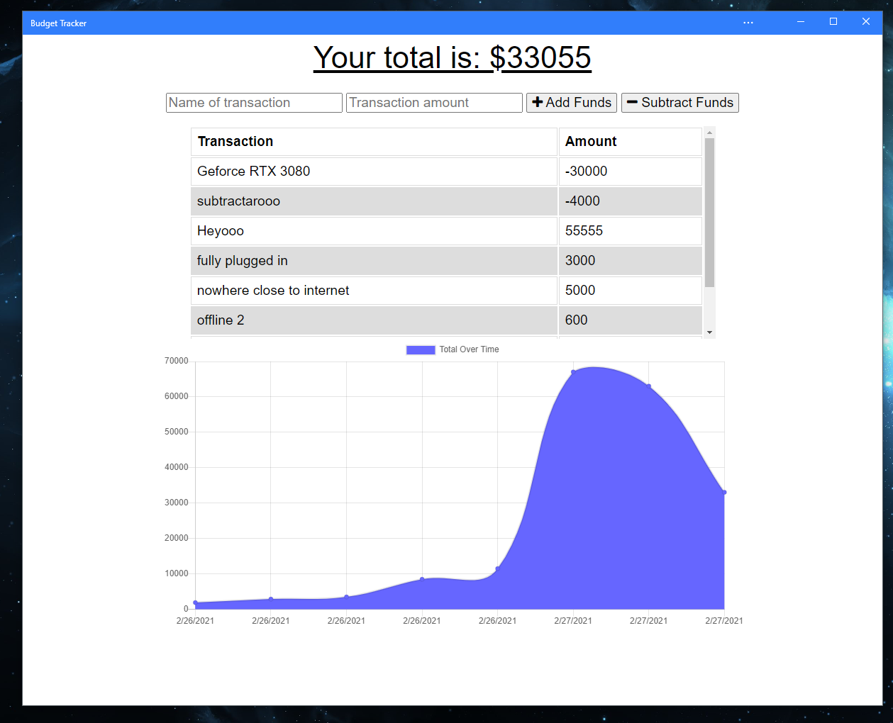

# Budget Tracker
 A budget tracker that also works offline as a progressive web app.


by Pirooz Wallace
2/27/21

[](#license)  -- MIT license fine print is also it's own file in the repo

Deployed Heroku App: [App on Heroku](https://secret-chamber-01910.herokuapp.com/)

GitHub Repo: [Budget Tracker repo](https://github.com/attack-theoRy/budget-pwa-offline-tracker)

Portfolio: [Portfolio](https://attack-theory.github.io/Portfolio/)


## Table of Contents
* [API's + Tech](#tech)
* [Description](#description)
* [Installation](#installation)
* [License](#license)
* [Questions](#questions)

## Tech
* Progressive Web App | Web Manifest
* Node.js
* Express
* Mongoose
* Robo 3T
* Heroku and Mongo db Atlas
* Morgan


## Description

This is a full-stack progressive web app that uses Node.js, Express routes, Mongoose, mongo DB atlas, heroku to track your budget. You can add or subtract to your budget. 



Because this is a progressive web app, you can also install it on your phone or desktop to use for offline use.




## Installation

The app can be found with no installation needed on heroku at :  https://secret-chamber-01910.herokuapp.com/
Or to use through terminal do the following:

To use properly you can either use `npm install ` to install all the dependencies from package.json or you can install the dependencies one by one. First need to install Node.js and in the terminal you have to use the command 
``` npm init -y ```

and then also install the following dependencies 

``` npm install express ```  to install express  (for routes)

``` npm install mongoose  ``` to install mongoose  (for databases)

``` npm install morgan ``` to install morgan (request logger middleware)

And then finally to start the application you type ``` node server.js ``` in the terminal.

## License

MIT License is in a separate file

## Questions
For questions please contact: Pirooz Wallace

at : PiroozWallace@outlook.com

Github Profile: https://github.com/attack-theoRy
